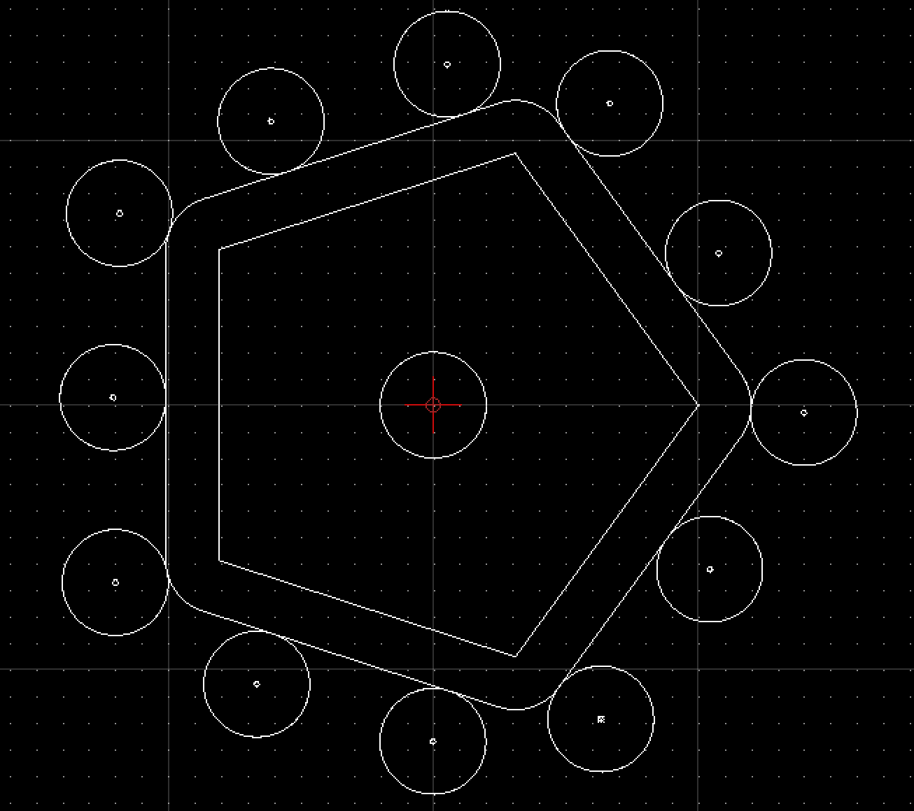

# yapCAD
yet another procedural CAD and computational geometry system written in python 3

## goals

The purpose of yapCAD is to support 2D and 3D computational geometry and CAD projects in python3.  yapCAD is designed to support multiple rendering back-ends, such that a relatively small amount of code is necessary to add support for a 2D or 3D cad or drawing file format.

The foundations of yapCAD are grounded in decades of the author's experience with graphics system programming, 3D CAD and simulation. At the same time, yapCAD should make the easy stuff easy, and the more advanced stuff possible. 

The initial implementation of yapCAD provides DXF file creation support through the awesome [ezdxf](https://github.com/mozman/ezdxf) package.

## examples

(for a more complete list, see the [examples folder](./examples/README.md))

It's pretty easy to make a DXF drawing with yapCAD.  Here is an example:

	from ezdxf_drawable import *
	from geom import *

	#set up DXF rendering
	drawable=ezdxfDraw()
    drawable.saveas("example1-out")

    ## make some geometry

    # make a point located at 10,10 in the x-y plane, rendered as a small
    # cross and circle
    point=Point(vect(10,10),"xo")

    # make a line segment between the points -5,10 and 10,-5 in the x-y plane
    line=Line(vect(-5,10),
	          vect(10,-5))

    # make an arc with a center at 0,3 with a radius of 3, from 45 degrees
    # to 135 degrees
    arc=Arc(vect(0,3),3,45,135)

    # Render the geometry we've just made
    point.draw()
    line.draw()
    arc.draw()

    # write out the geometry as example1-out.dxf
	drawable.display()

The yapCAD system isn't just about rendering, of course, it's about computational geometry.  For example, if you want to calculate the intersection of lines and arcs in a plane, we have you covered:

	from geom import *

    # define some points
    a = vect(5,0)
    b = vect(0,5)
    c = vect(-3,0)
    d = vect(10,10)

    # make a couple of lines
    l1 = [a,b]
    l2 = [c,d]

    # define a semicircular arc centerd at 2.5, 2,5 with a radius of 2.5
    # extending from 90 degress to 135 degrees

    arc1=[vect(2.5,2.5),vect(2.5,90.0,270.0)]

    # calculate the intersection of lines l1 and l2
    int0 = intersectXY(l1,l2)

    # calculate the intersection of the line l1 and the arc arc1
    int1 = lineArcIntersectXY(l1,arc1,True)

    print("intersection of l1 and l2:",vstr(int0))
    print("intersection of l1 and arc1:",vstr(int1))
	
And there are lots more [examples](examples/README.md) available to demonstrate the various computational geometry and rendering capabilities of yapCAD.

## geometry

yapCAD distinguishes between "pure" geometric elements, such as
vectors, and things you draw, such `Point` instances.  The reason for this
distinction is that the pure geometry doesn't care about details like
how you might draw it, it's just vectors and scalar geometric
parameters.  This makes geometric operations cleaner and faster, as we
are just passing around Python 3 lists.

### geometric representations
For the sake of uniformity, all yapCAD vectors are stored as
projective geometry 4-vectors. (see discussion in **architecture**,
below) However, most of the time you
will work with them as though they are 3-vectors or 2-vectors.

It woud be annoying to have to specify the redundant coordinates you
aren't using every time you specify a vector, so yapCAD provides you
with the `vect` function.  It fills in defaults for the z and w
parameters you may not want to specify.  ***e.g.***

    >>> from geom import *
    >>> vect(10,4)
    [10, 4, 0, 1]
	>>> add(vect(10,4),vect(10,9))  ## add operates in 3-space
    [20, 13, 0, 1.0]
	
Of course, you can specify all three coordinates using `vect`.  To
specify all four coordinates, just make the vector manually.

Since it gets ugly to look at a bunch of [x, y, z, w] lists that all
end in `0, 1]` when you are doing 2D stuff, yapCAD provides a
convenience function `vstr` that intelligently converts yapCAD vectors
(and lists that contain vectors, such as lines, triangles, and
polygons) to strings, assuming that as long as z = 0 and w = 1, you
don't need to see those coordinates.

    >>> from geom import *
    >>> a = sub(vect(10,4),vect(10,9)) ## subtract a couple of vectors 
    >>> a
    [0, -5, 0, 1.0]
    >>> print(vstr(a)) ## pretty printing, elide the z and w coordinates
    >>> [0, -5]

### pure geometry
Pure geometry includes vectors, lines, triangles, and polygons.  A
vector is a list of exactly four numbers, each of which is a float or
integer.  A line is a list of two vectors, a triangle a list of three,
and a polygon a list of 3 or more.

Pure geometry also includes arcs.  An arc is a list of two or three
vectors. (technically, one or two vectors and a pseudovector) The
first list element is interpreted as the vector center of the arc, the
second is interpreted as three scalar parameters `[r, s, e]`: the
radius, the start angle in degrees, and the end angle in degrees.  The
third (if it exists) is the normal vector for the plane of the arc,
which is assumed to be `[0, 0, 1]` (the x-y plane) if it is not
specified.

### drawable geometry

The idea is that you will do your computational geometry with "pure"
geometry, and then generate rendered previews or output with Drawable
objects.

Drawable geometry in yapCAD are subclasses of `Drawable`, which at
present include `Point`, `Line`, and `Arc` subclasses. Support for
`Polyline`, `Polygon`, and `RoundedPolygon` is planned.

To setup a drawing environment, you will create an instance of the
`Drawable` base class corresponding to the rendering system you want
to use.

To draw, create the geometry and then invoke the `draw` method.  To
display or write out the results you will invoke the `display` method
of the drawable instance. 

#### supported rendering systems

DXF rendering using ezdxf is currently supported, and the design of
yapCAD makes it easy to support other rendering backends.

## architecture

Under the hood, yapCAD is using [projective coordiates](https://en.wikipedia.org/wiki/Homogeneous_coordinates), sometimes called homogeneous coordinates, to represent points as 3D coodinates in the w=1 hyperplane. If that sounds complicated, its because it is. :P  But it does allow for a wide range of geometry operations, specifically [affine transforms](https://www.cs.utexas.edu/users/fussell/courses/cs384g-fall2011/lectures/lecture07-Affine.pdf) to be represented as composable transformation matricies. The benefits of this conceptual complexity is an architectual elegance and generality.

What does that buy you? It means that under the hood, yapCAD uses the same type of geometry engine that advanced CAD and GPU-based rendering systems use, and should allow for a wide range of computational geomety systems, possibly hardware-accelerated, to be built on top of it.

The good news is that you don't need to know about homogeneous coordinates, affine transforms, etc., to use yapCAD.  And most of the time you can pretend that your vectors are just two-dimensional if everything you are doing happens to lie in the x-y plane.

So, if you want to do simple 2D drawings, we have you covered.  If you want to buid a GPU-accelerated constructive solid geometry system, you can do that, too.
