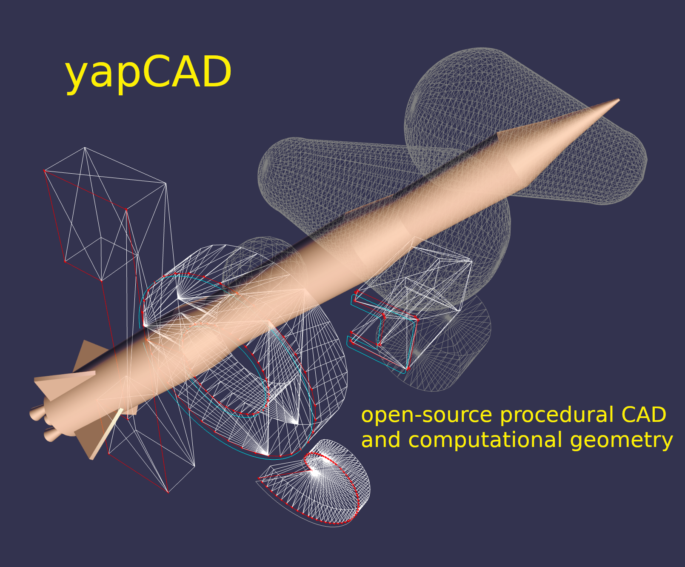

# **yapCAD**
yet another procedural CAD and computational geometry system written in python 3

## what's **yapCAD** for?

First and foremost, **yapCAD** is a framework for creating
[parametric](https://en.wikipedia.org/wiki/Parametric_design),
procedural, and
[generative](https://en.wikipedia.org/wiki/Parametric_design) design
systems.  You can also use **yapCAD** for other CAD, CAM, and
computational geometry purposes.

## software status

**yapCAD** is still very much in **beta**, although it is already being
used by for professional engineering purposes.  If you are using
**yapCAD** in interesting ways, feel free to let us know in the
[**yapCAD** discussions](https://github.com/rdevaul/yapCAD/discussions)
forum

## **yapCAD** installation, documentation, and examples

### installation
**yapCAD** is a pure python library, so no special steps are required
for installation.  You can install it a variety of ways, but the
recommended method is to use pip to install it into your local
`site-packages` directory, as follows:

	pip install yapCAD --user
	
You can also clone the github repository and install from source:

	git clone https://github.com/rdevaul/yapCAD.git
	cd yapCAD
	python setup.py install --user

### examples

The **yapCAD** github repository includes examples. To run the
examples, clone the github repository as shown above, and make sure
that your PYTHONPATH includes the cloned top-level `yapCAD` directory.
You will find the examples in the `yapCAD/examples` directory.

For a fully worked parametric design system, see the `boxcut` example.

### documentation

Online **yapCAD** documentation can be found here:
https://yapcad.readthedocs.io/en/latest/ &mdash; for some reason
`readthedocs.io` isn't generating the full module documentation, so
you might want to build a local copy, as described below.

To build the HTML **yapCAD** documentation locally, first make sure
you have the sphinx package installed:

	pip install sphinx --user

Then clone the github repository as shown above,
`cd` to the `yapCAD` directory, and type

	make -C docs html
	
This will build the HTML documents in the `build/sphinx/html`
directory.  You can also build documentation in the other formats
supported by Sphinx.  See the [Sphinx
documentation](https://www.sphinx-doc.org/en/master/) for more
information.

## **yapCAD** goals

The purpose of **yapCAD** is to support 2D and 3D computational
geometry and parametric, procedural, and generative design projects in
python3.  **yapCAD** is designed to support multiple rendering
back-ends, such that a relatively small amount of code is necessary to
add support for a 2D or 3D cad or drawing file format.  At present,
**yapCAD** supports the AutoCad DXF file format for creating
two-dimensional drawings and OpenGL for creating interactive 2D and 3D
renderings.

The foundations of **yapCAD** are grounded in decades of the author's
experience with graphics system programming, 3D CAD and
simulation. **yapCAD** has an underlying framework and architecture
designed to support sophisticated computational geometry and
procedural CAD applications.  At the same time, the design of
**yapCAD** should make easy stuff relatively easy, and the more
advanced stuff possible.

The initial implementation of **yapCAD** provides DXF file creation
support through the awesome [ezdxf](https://github.com/mozman/ezdxf)
package, and interactive OpenGL visualization using the amazing
[pyglet](https://github.com/pyglet/pyglet) package.

## **yapCAD** examples

(for a more complete list, see the [examples folder](./examples/))

It's pretty easy to make a DXF drawing with **yapCAD**.  Here is an example:

	from yapcad.ezdxf_drawable import *
	from yapcad.geom import *

	#set up DXF rendering
	dd=ezdxfDraw()
    dd.filename = "example1-out"

    ## make dxf-renderable geometry

    # make a point located at 10,10 in the x-y plane, rendered as a small
    # red cross and circle
	dd.pointstyle = 'xo' # also valid are 'x' or 'o'
	dd.linecolor = 1 # set color to red (DXF index color 1)
    dd.draw(point(10,10))

    # make a line segment between the points -5,10 and 10,-5 in the x-y plane
	# and draw it in white
	
	dd.linecolor='white' # set color by name
    dd.draw(line(point(-5,10),
		         point(10,-5)))

    # make an arc with a center at 0,3 with a radius of 3, from 45 degrees
    # to 135 degrees, and draw it in aqua
	
	dd.linecolor=[0,255,255] # RGB tripple, corresponds to 'aqua'
    dd.draw(arc(point(0,3),3,45,135))

    # write out the geometry as example1-out.dxf
	dd.display()

The **yapCAD** system isn't just about rendering, of course, it's
about computational geometry.  For example, if you want to calculate
the intersection of lines and arcs in a plane, we have you covered:

	from yapcad.geom import *

    # define some points
    a = point(5,0)
    b = point(0,5)
    c = point(-3,0)
    d = point(10,10)

    # make a couple of lines
    l1 = line(a,b)
    l2 = line(c,d)

    # define a semicircular arc centered at 2.5, 2,5 with a radius of 2.5
    # extending from 90 degrees to 135 degrees

    arc1=arc(point(2.5,2.5),2.5,90.0,270.0)

    # calculate the intersection of lines l1 and l2
    int0 = intersectXY(l1,l2)

    # calculate the intersection of the line l1 and the arc arc1
    int1 = intersectXY(l1,arc1)

    print("intersection of l1 and l2:",vstr(int0))
    print("intersection of l1 and arc1:",vstr(int1))
	
And of course **yapCAD** supports calculating intersections between
any simple and compound, or compound and compound geometry object.

There are lots more [examples](examples/README.md) available to
demonstrate the various computational geometry and rendering
capabilities of **yapCAD**, including 3D geometry and OpenGL
rendering.

## **yapCAD** geometry

**yapCAD** distinguishes between "pure" geometric elements, such as lines,
arcs, ***etc.***, and drawn representations of those things, which
might have attributes like line color, line weight, drawing layer,
***etc.*** This distinction is important, because the pure geometry
exists independent of these attributes, which are themselves
rendering-system dependent.

More importantly, for every geometric element you decide to draw,
there will typically be many more &mdash; perhaps dozens &mdash; that
should not be in the final rendering.  By separating these two
elements &mdash; computation and rendering &mdash; **yapCAD** makes them
both more intentional and reduces the likelihood of certain type of
drawing-quality issues, such as redundant or spurious drawing
elements, that can cause confusion problems for computer-aided
manufacturing (CAM).

For example, you might construct a finished drawing that includes a
drill pattern that consists of circles (drill holes with centers) that
follow a complex, geometrically constrained pattern.  This pattern is
itself the result of numerous computational geometry operations,
perhaps driven by parameters relating to the size and shape of other
parts. 

In a program like Autodesk's Fusion360, you would typically use
construction lines and constraints to create the underlying geometric
pattern.  These additional construction elements would have to be
removed in order to make a clean DXF export of your drawing.  On more
than one occasion **yapCAD**'s author has created headaches by failing to
remove some of these elements, confusing CAM technicians, causing
delays, and sometimes resulting in expensive part fabrication errors.

Thus, **yapCAD** allows you to work freely with computational geometry
without cluttering up your drawing page, since you specifically decide
what to draw.  It also means you can do computational geometry in
**yapCAD** without ever invoking a rendering system, which can be useful
when incorporating these geometry operations as part of a larger
computational system, such as a tool-path generator. 

As a rule, in **yapCAD** pure geometry representations capture only the
minimum necessary to perform computational geometry, and the rest gets
dealt with by the rendering system, which are subclasses of `Drawable`
that actually make images, CAD drawings, ***etc.***

### vector representation in **yapCAD**
For the sake of uniformity, all **yapCAD** vectors are stored as
projective geometry 4-vectors. (see discussion in **architecture**,
below) However, most of the time you
will work with them as though they are 3-vectors or 2-vectors.

It would be annoying to have to specify the redundant coordinates you
aren't using every time you specify a vector, so **yapCAD** provides you
with the `vect` function.  It fills in defaults for the z and w
parameters you may not want to specify.  ***e.g.***

    >>> from yapcad.geom import *
    >>> vect(10,4)
    [10, 4, 0, 1]
	>>> add(vect(10,4),vect(10,9))  ## add operates in 3-space
    [20, 13, 0, 1.0]
	
Of course, you can specify all three (or even four) coordinates using
`vect`. 

Since it gets ugly to look at a bunch of [x, y, z, w] lists that all
end in `0, 1]` when you are doing 2D stuff, **yapCAD** provides a
convenience function `vstr` that intelligently converts **yapCAD** vectors
(and lists that contain vectors, such as lines, triangles, and
polygons) to strings, assuming that as long as z = 0 and w = 1, you
don't need to see those coordinates.

    >>> from yapcad.geom import *
    >>> a = sub(vect(10,4),vect(10,9)) ## subtract a couple of vectors 
    >>> a
    [0, -5, 0, 1.0]
    >>> print(vstr(a)) ## pretty printing, elide the z and w coordinates
    >>> [0, -5]

### pure geometry
Pure geometric elements in **yapCAD** form the basis for computational
geometry operations, including intersection and inside-outside
testing.  Pure geometry can also be drawn, of course &mdash; see
**drawable geometry** below.

In general, **yapCAD** pure geometry supports the operations of
parametric sampling, intersection calculation, inside-outside testing
(for closed figures), "unsampling" (going from a point on the figure
to the sampling parameter that would produce it), and bounding box
calculation.  **yapCAD** geometry is based on projective or
homogeneous coordinates, thus supporting generalized affine
transformations; See the discussion in **architecture**, below.

#### simple (non-compound) pure geometric elements
Simple, which is to say non-compound, geometry includes vectors,
points, and lines.  A vector is a list of exactly four numbers, each
of which is a float or integer.  A point is a vector that lies in a 
w > 0 hyperplane; Points are used to represent transformable
coordinates in **yapCAD** geometry.  A line is a list of two points.

Simple geometry also includes arcs.  An arc is a list of a point and a
vector, followed optionally by another point. The first list element
is the center of the arc, the second is a vector in the w=-1
hyperplane (for right-handed arcs) whose first three elements are the
scalar parameters `[r, s, e]`: the radius, the start angle in degrees,
and the end angle in degrees.  The third element (if it exists) is the
normal for the plane of the arc, which is assumed to be `[0, 0, 1]`
(the x-y plane) if it is not specified.  Arcs are by default
right-handed, but left-handed arcs are also supported, with parameter
vectors lying in the w=-2 hyperplane.

#### compound figures

A list of more than two points represents a multi-vertex polylines.
If there are at least four points in the list and the last point is
the same as the first, the polyline figure is closed. (We sometimes
refer to these point-list polygons or polylines as `poly()` entities.)
Closed coplanar polylines are drawn as polygons and may be subject to
inside-outside testing.  Like other elements of pure geometry,
polylines are subject to sampling, unsampling, intersection
calculation, **etc.**

If instead of sharp corners you want closed or open figures with
rounded corners, you should use `Polyline` or `Polygon`
instances. Instances of these classes are used for representing
compound geometric elements in an XY plane with C0 continuity.  They
differ from the point-list-based `poly()` representation in that the
elements of a `Polyline` or `Polygon` can include lines and arcs as
well as points.  These elements need not be contiguous, as successive
elements will be automatically joined by straight lines.  `Polygons`
are special in that they are always closed, and that any full circle
elements are interpreted as "rounded corners," with the actual span of
the arc calculated after tangent lines are drawn.

The `Polygon` class supports boolean operations, as described below,
and also supports the `grow()` operation that makes generating a
derived figure that is bigger by a fixed amount easy.  This grow
feature is very useful for many engineering operations, such as
creating an offset path for drill holes, CAM paths, etc.

#### boolean operations on `Polygon` instances
**yapCAD** supports boolean set operations on `Polygon` instances,
allowing you to construct more complex two-dimensional figures from
union, intersection, and difference operations.  Note that the
difference operation can result in the creation of disjoint geometry
in the form of two or more closed figures with positive area (see
below), or closed figures with holes.

See [Example 11](./examples/example11.py) for a relatively simple
example of boolean operations, and [Example
12](./examples/example12.py) for a more complex example.

**yapCAD** employs the convention that closed figures with
right-handed geometry (increasing the sampling parameter corresponds
to points that trace a counter-clockwise path) represent "positive"
area, and that closed figures with left-handed geometry represent
holes.  This distinction is currently not operational, but will be
important for future development such as turning polygons into rendered
surfaces and extruding these surfaces into 3D.

#### disjoint compound geometry 

Boolean difference operations can result in disjoint figures.  It is
also possible to combine **yapCAD** geometric elements in geometry
lists, which is to say a list of zero or more elements of **yapCAD**
pure geometry, which enforce no continuity constraints.  Geometry
lists provide the basis for **yapCAD** rendering.

### drawable geometry

The idea is that you will do your computational geometry with "pure"
geometry, and then generate rendered previews or output with one or
more `Drawable` instances.

In **yapCAD**, geometry is rendered with instances of subclasses of
`Drawable`, which at present include `ezdxfDrawable`, a class for
producing DXF renderings using the awesome `ezdxf` package, and
`pygletDrawable`, a class for interactive 2D and 3D OpenGL rendering.

To setup a drawing environment, you create an instance of the
`Drawable` base class corresponding to the rendering system you want
to use.

To draw, create the pure geometry and then pass that to the drawbles's
`draw()` method.  To display or write out the results you will invoke
the `display` method of the drawable instance.

#### supported rendering systems

DXF rendering using `ezdxf` and interactive OpenGL rendering using
`pyglet` are currently supported, and the design of **yapCAD** makes
it easy to support other rendering backends.

## **yapCAD** architecture

Under the hood, **yapCAD** is using [projective
coordinates](https://en.wikipedia.org/wiki/Homogeneous_coordinates),
sometimes called homogeneous coordinates, to represent points as 3D
coordinates in the w=1 hyperplane. If that sounds complicated, its
because it is. :P But it does allow for a wide range of geometry
operations, specifically [affine
transforms](https://www.cs.utexas.edu/users/fussell/courses/cs384g-fall2011/lectures/lecture07-Affine.pdf)
to be represented as composable transformation matrices. The benefits
of this conceptual complexity is an architectural elegance and
generality.

Support for affine transforms is at present rudimentary, but once a
proper matrix transform stack is implemented it will allow for the
seamless implementation and relatively easy use of a wide range of
transformation and projection operations.

What does that buy you? It means that under the hood, **yapCAD** uses the
same type of geometry engine that advanced CAD and GPU-based rendering
systems use, and should allow for a wide range of computational
geometry systems, possibly hardware-accelerated, to be built on top of
it.

The good news is that you don't need to know about homogeneous
coordinates, affine transforms, etc., to use **yapCAD**.  And most of the
time you can pretend that your vectors are just two-dimensional if
everything you are doing happens to lie in the x-y plane.

So, if you want to do simple 2D drawings, we have you covered.  If you
want to build a GPU-accelerated constructive solid geometry system, you
can do that, too.

## Note

This project has been set up using PyScaffold 3.2.3. For details and usage
information on PyScaffold see https://pyscaffold.org/.
