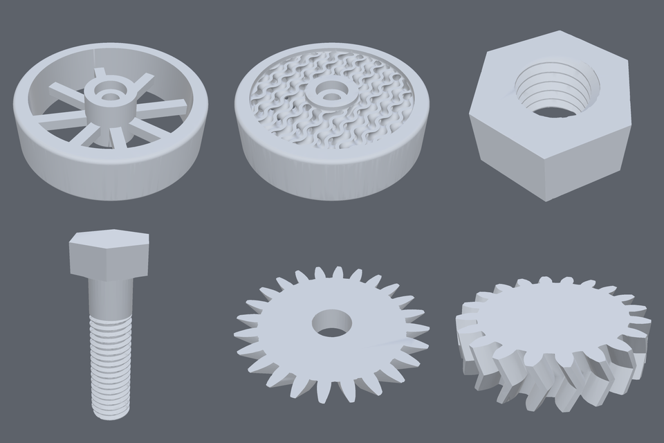
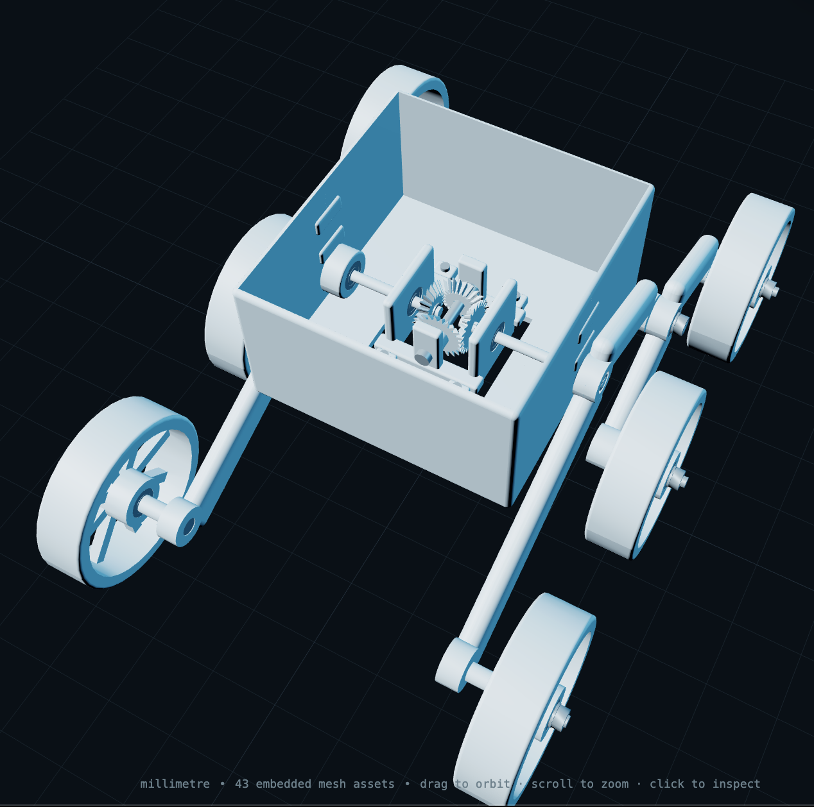
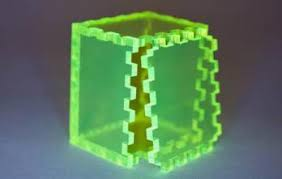

======
yapCAD
======

**yapCAD** is a procedural CAD and computational geometry system written in
Python_. Designs are programs -- Python, or yapCAD's own parametric DSL --
so a part is regenerated, not redrawn, when a dimension changes.

yapCAD models solids three ways, and lets each part use the one that suits
it (see :doc:`representations`):

* **Signed distance fields**, for exact booleans, fillets, blends, offsets
  and lattices that cannot fail, with nothing but numpy. Fasteners and
  gears have field versions, and a whole DSL design builds as fields with
  one setting. Start with :doc:`sdf_guide`.
* **OpenCASCADE BREPs**, optional, for exact surfaces, fillets on any edge
  and analytic STEP.
* **Triangle meshes**, for everything else, including imported STL, with
  robust booleans.

Packages (``.ycpkg``) carry a design's geometry, assembly, bill of
materials, provenance and signatures, and the assembly system solves mates
and joints across parts.

         M8 nut and bolt, a miter gear and a herringbone gear

   Parts built as signed distance fields, without OpenCASCADE, by
   ``examples/sdf_parts_demo.py``. See :doc:`examples`.

   The yapRover rocker-bogie rover, a yapCAD DSL design. Its release
   design builds either with OpenCASCADE or entirely as fields.

Contents
========

.. toctree::
   :maxdepth: 2
   :caption: Getting started

   Installation <installation>
   Representations and boolean engines <representations>
   README <README>

.. toctree::
   :maxdepth: 2
   :caption: Signed distance functions

   The SDF guide <sdf_guide>
   Examples <examples>
   SDF design notes <SDF-DESIGN>

.. toctree::
   :maxdepth: 2
   :caption: The DSL

   DSL tutorial <dsl_tutorial>
   DSL guide <dsl_guide>
   DSL reference <dsl_reference>

.. toctree::
   :maxdepth: 2
   :caption: Solids, assemblies and manufacturing

   BREP and OpenCASCADE <yapBREP>
   Assemblies <assembly_system>
   Mesh validation <mesh_validation>
   Manufacturing post-processing <manufacturing_postprocessing>

.. toctree::
   :maxdepth: 2
   :caption: Packages and formats

   Package format (.ycpkg) <ycpkg_spec>
   Product definition <ycpkg_product_definition>
   Manufacturing exports <ycpkg_manufacturing>
   Geometry JSON <geometry_json_schema>
   Metadata namespace <metadata_namespace>
   Validation schema <validation_schema>
   Package signing <signing_spec>
   Material schema <material_schema_spec>

.. toctree::
   :maxdepth: 2
   :caption: Reference

   Module reference <api/modules>
   Changelog <changelog>
   Roadmap <yapCADone>
   License <license>
   Authors <authors>

Indices and tables
==================

* :ref:`genindex`
* :ref:`modindex`
* :ref:`search`

What is Parametric Design?
==========================

`Parametric design`_ is a generalizable approach to solving design
problems by means of parameters and algorithms, as opposed to the
creation of static drawings or models.  Put another way, a
conventional design is like a drawing, and a parametric design is like
a piece of software that you configure to create the specific drawing
that you want.

the acrylic box: a parametric design example
--------------------------------------------

For example, imagine that you wanted to design a decorative acrylic
box to be assembled from pieces cut from a sheet of material of
uniform thickness.  This box will be a squeeze-fit design, so that it
assembles like a 3D jigsaw puzzle, without the need for additional
glue or fasteners.

You might decide on the dimensions of your box, and a scheme by which
you cut the edges to create tabs and slots so that when cut, the box
will fit together just so.  However, the depth of your tabs and slots
will necessarily depend on the thickness of the material, which might
vary slightly from sheet to sheet, or vendor to vendor. Furthermore,
your cutting tool (perhaps a laser cutter) will create a kerf, or
width of cut, that vary from machine to machine and with depth of
focus.

Finally, your box might be sized to hold a variety of contents, which
themselves might vary in size and shape.

One approach is to create a conventional design. You could draw your
design for one size of box, material, and thickness of cut, and then
hope you have your tolerances correct.  If there is a problem, or you
want to change box dimensions, you will need to go back and revise
your design.  Each time you revise, you are essentially redoing the
entire drawing from scratch.

Alternately, you could create a parametric design, in which the
desired length, width, and height of the box are input parameters,
along with the thickness of the material and an estimate of the kerf.
Creating a parametric design system might be a bit more difficult than
creating a conventional drawing, but once you are done you will be
able to generate the design for any desired box, from any desired
material thickness, with any kerf, simply by changing a few numbers --
automatically, and without having to revise any code or drawing.

.. note::

   For a **yapCAD** solution to this particular problem, see the
    ``boxcut`` example in the ``examples`` directory for a 2D parametric
    workflow, and ``rocket_demo.py`` for a 3D generative workflow that
    visualises and exports STL.

This ability to solve for an entire family of related design problems
with a single parametric design system is what gives this approach
it's power and flexibility.  For anyone who has spent hours
re-drafting a drawing to accommodate minor variations in requirements,
this can be an impressive force multiplier on productivity.

Generative fasteners
--------------------

The ``yapcad.fasteners`` helpers provide canonically parameterized screws, nuts, and washers for both metric and unified standards.  They build on the thread sampler developed for the involute gear work and support external/internal threads, handedness, multi-start configurations, and catalog-backed defaults.  See ``examples/threaded_fastener_package.py`` for a CLI that emits ``.ycpkg`` packages for common fasteners, or consume the helpers directly from Python/DSL to populate assemblies.

.. _AutoCad DXF: https://en.wikipedia.org/wiki/AutoCAD_DXF
.. _parametric design: https://en.wikipedia.org/wiki/Parametric_design
.. _module reference: ./api/modules
.. _toctree: http://www.sphinx-doc.org/en/master/usage/restructuredtext/directives.html
.. _reStructuredText: http://www.sphinx-doc.org/en/master/usage/restructuredtext/basics.html
.. _references: http://www.sphinx-doc.org/en/stable/markup/inline.html
.. _Python domain syntax: http://sphinx-doc.org/domains.html#the-python-domain
.. _Sphinx: http://www.sphinx-doc.org/
.. _Python: http://docs.python.org/
.. _Numpy: http://docs.scipy.org/doc/numpy
.. _SciPy: http://docs.scipy.org/doc/scipy/reference/
.. _matplotlib: https://matplotlib.org/contents.html#
.. _Pandas: http://pandas.pydata.org/pandas-docs/stable
.. _Scikit-Learn: http://scikit-learn.org/stable
.. _autodoc: http://www.sphinx-doc.org/en/stable/ext/autodoc.html
.. _Google style: https://github.com/google/styleguide/blob/gh-pages/pyguide.md#38-comments-and-docstrings
.. _NumPy style: https://numpydoc.readthedocs.io/en/latest/format.html
.. _classical style: http://www.sphinx-doc.org/en/stable/domains.html#info-field-lists
