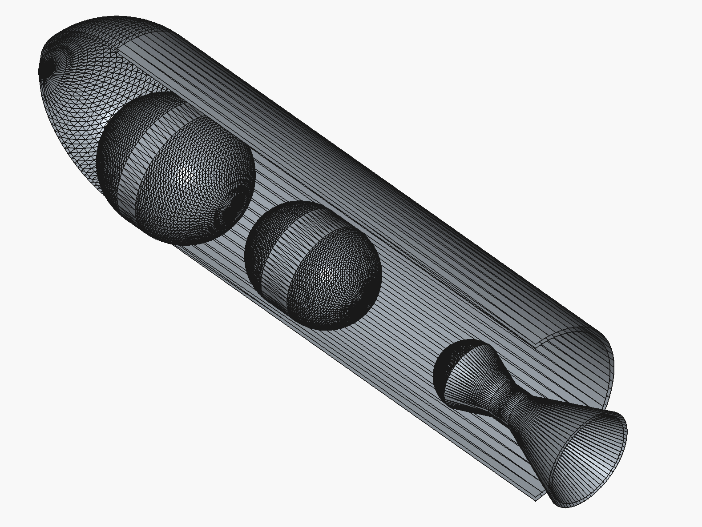

======
yapCAD
======

.. figure:: images/RocketDemoScreenshot.png
   :width: 400px
   :alt: parametric rocket example

   Multi-stage rocket generated with **yapCAD** and exported to STL.

   Internal layout from ``examples/rocket_cutaway_internal.py`` rendered from
   the exported STEP file in FreeCAD.

Welcome to **yapCAD**, yet another procedural CAD and computational
geometry system, written in Python_.  The project is in active development,
with recent releases focusing on production-ready 3D generative workflows
(solid modeling, robust boolean operations, STL/STEP export, interactive
rendering) alongside the original 2D/DXF tooling.

.. note::

    **yapCAD** was created to solve some fairly specific problems in
    procedural CAD and `parametric design`_.  Earlier releases were
    primarily geared toward generating 2D drawings in the `AutoCad
    DXF`_ format; the current 0.5.x series delivers robust 3D boolean
    operations, validated primitive generation, comprehensive mesh
    validation tools, and production-ready STL/STEP export.

    Why use yapCAD? yapCAD allows you to transform the 2D and 3D mechanical
    design process from the manual creation of drawings, parts, and assemblies
    into a highly automatable process focused creation of
    modular, parametric, and even LLM-generated code.

    Because yapCAD's foundations are in software, you can use powerful agentic
    or "vibe coding" tools to translate your design intent into functional and
    parameterized design, without ever writing a line of code yourself. For
    example, the rocket example rendered above was generated in one-shot by
    `gpt-5-codex` from the prompt: "Using what you know about yapCAD, I'd like
    you to create a demo that builds a simple 3D model of a rocket, visualizes
    it using pyglet, and then writes out the STL file. I'd like the rocket to
    have a cluster of five engines, guidance fins, a cylindrical body with at
    least one diameter transition before the payload fairing, and an aerodynamic
    fairing. Can you do this for me?"

    And becuse yapCAD designs are software, they can be parametric and modular.
    So if you are tired of manually editing your CAD files whenever you change the
    thickness of a material, the size of a pipe fitting, or the diameter and
    spacing of bolts, *etc.*, this might just be the tool you are looking for.

    For an example and discussion of what parametric design is and why
    it might be useful see `What is Parametric Design?`_ below.

    Much of the documentation for **yapCAD** can be found in the
    **README** files, as well as in the ``yapcad.geom`` module
    documentation linked below.  Key helper modules include
    ``yapcad.geometry_utils``/``yapcad.triangulator`` (triangle
    helpers and ear-cut tessellation), ``yapcad.geometry_checks`` (mesh
    validation), ``yapcad.metadata`` (surface/solid provenance),
    ``yapcad.geom3d_util.stack_solids`` and ``cutaway_solid_x`` (layout and
    section tools), ``yapcad.boolean.native`` (production-ready boolean
    engine), and ``yapcad.io`` for validated STL/STEP export.

Contents
========

.. toctree::
   :maxdepth: 4

   License <license>
   Authors <authors>
   Changelog <changelog>
   Module Reference <api/modules>
   README <README>	      

Indices and tables
==================

* :ref:`genindex`
* :ref:`modindex`
* :ref:`search`

What is Parametric Design?
==========================

`Parametric design`_ is a generalizable approach to solving design
problems by means of parameters and algorithms, as opposed to the
creation of static drawings or models.  Put another way, a
conventional design is like a drawing, and a parametric design is like
a piece of software that you configure to create the specific drawing
that you want.

the acrylic box: a parametric design example
--------------------------------------------

For example, imagine that you wanted to design a decorative acrylic
box to be assembled from pieces cut from a sheet of material of
uniform thickness.  This box will be a squeeze-fit design, so that it
assembles like a 3D jigsaw puzzle, without the need for additional
glue or fasteners.

.. image:: images/laserbox.jpg
   :alt: picture of a laser-cut acrylic box, squeeze-fit design
   :width: 221px

You might decide on the dimensions of your box, and a scheme by which
you cut the edges to create tabs and slots so that when cut, the box
will fit together just so.  However, the depth of your tabs and slots
will necessarily depend on the thickness of the material, which might
vary slightly from sheet to sheet, or vendor to vendor. Furthermore,
your cutting tool (perhaps a laser cutter) will create a kerf, or
width of cut, that vary from machine to machine and with depth of
focus.

Finally, your box might be sized to hold a variety of contents, which
themselves might vary in size and shape.

One approach is to create a conventional design. You could draw your
design for one size of box, material, and thickness of cut, and then
hope you have your tolerances correct.  If there is a problem, or you
want to change box dimensions, you will need to go back and revise
your design.  Each time you revise, you are essentially redoing the
entire drawing from scratch.

Alternately, you could create a parametric design, in which the
desired length, width, and height of the box are input parameters,
along with the thickness of the material and an estimate of the kerf.
Creating a parametric design system might be a bit more difficult than
creating a conventional drawing, but once you are done you will be
able to generate the design for any desired box, from any desired
material thickness, with any kerf, simply by changing a few numbers --
automatically, and without having to revise any code or drawing.

.. note::

   For a **yapCAD** solution to this particular problem, see the
    ``boxcut`` example in the ``examples`` directory for a 2D parametric
    workflow, and ``rocket_demo.py`` for a 3D generative workflow that
    visualises and exports STL.

This ability to solve for an entire family of related design problems
with a single parametric design system is what gives this approach
it's power and flexibility.  For anyone who has spent hours
re-drafting a drawing to accommodate minor variations in requirements,
this can be an impressive force multiplier on productivity.

.. _AutoCad DXF: https://en.wikipedia.org/wiki/AutoCAD_DXF
.. _parametric design: https://en.wikipedia.org/wiki/Parametric_design
.. _module reference: ./api/modules
.. _toctree: http://www.sphinx-doc.org/en/master/usage/restructuredtext/directives.html
.. _reStructuredText: http://www.sphinx-doc.org/en/master/usage/restructuredtext/basics.html
.. _references: http://www.sphinx-doc.org/en/stable/markup/inline.html
.. _Python domain syntax: http://sphinx-doc.org/domains.html#the-python-domain
.. _Sphinx: http://www.sphinx-doc.org/
.. _Python: http://docs.python.org/
.. _Numpy: http://docs.scipy.org/doc/numpy
.. _SciPy: http://docs.scipy.org/doc/scipy/reference/
.. _matplotlib: https://matplotlib.org/contents.html#
.. _Pandas: http://pandas.pydata.org/pandas-docs/stable
.. _Scikit-Learn: http://scikit-learn.org/stable
.. _autodoc: http://www.sphinx-doc.org/en/stable/ext/autodoc.html
.. _Google style: https://github.com/google/styleguide/blob/gh-pages/pyguide.md#38-comments-and-docstrings
.. _NumPy style: https://numpydoc.readthedocs.io/en/latest/format.html
.. _classical style: http://www.sphinx-doc.org/en/stable/domains.html#info-field-lists
